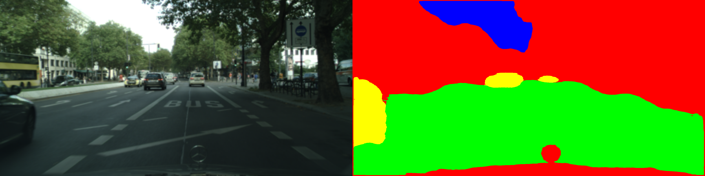
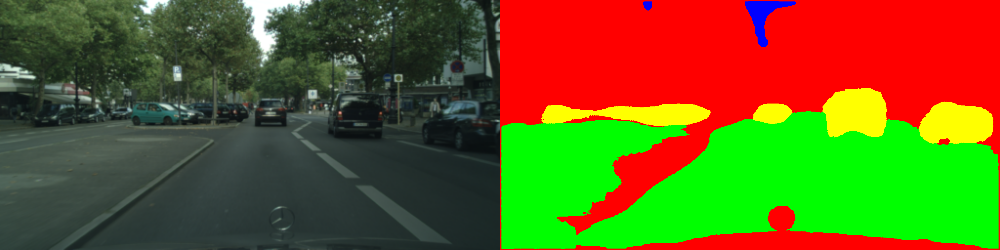

# U-Net pytorch Implementation
This repository contains pytorch implementation of [U-Net](https://arxiv.org/abs/1505.04597) architectures. The number of classes used for training is 4 currently (road, sky, car, unlabelled). 

## Examples

## TO-DO
- [x] Define Contracting/Expansive Path 
- [x] Define customed Cityscapes dataset and dataloader
- [x] Add additional functions
- [x] Train / Test Model
- [ ] Refactoring 
- [ ] Results

## Dataset 
- Cityscapes (https://paperswithcode.com/dataset/cityscapes)

- [a label and all meta information](https://github.com/mcordts/cityscapesScripts/blob/master/cityscapesscripts/helpers/labels.py) - also you can find at [here](./assets/labels.py).