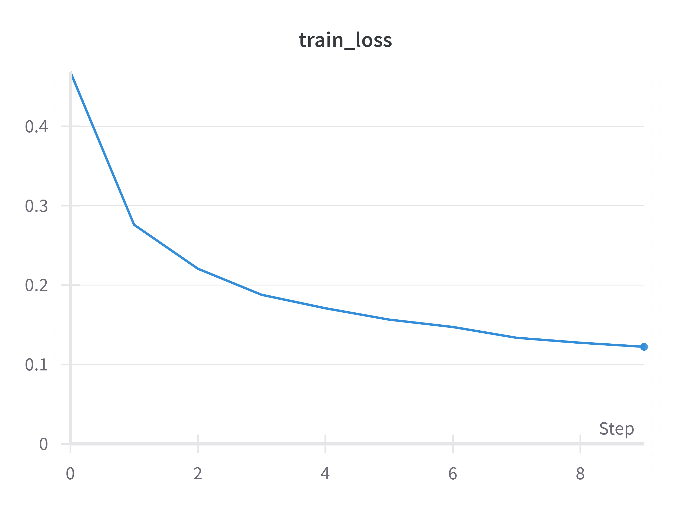
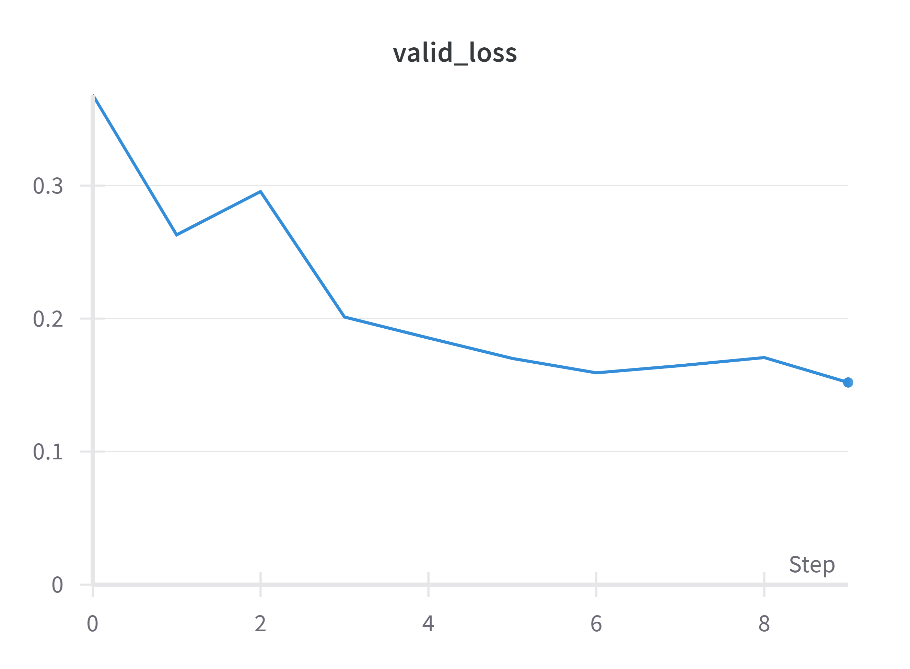

# U-Net pytorch Implementation
This repository contains an implementation of the [U-Net](https://arxiv.org/abs/1505.04597) architecture in PyTorch. The implemented network is trained on the [Cityscapes](https://paperswithcode.com/dataset/cityscapes) dataset. The number of classes used for training is currently four (`road`, `sky`, `car`, `unlabeled`). The codes related to the architecture is in `model.py` and `blocks.py`. Blocks for the contracting and expanding paths are defined in `blocks.py` and are combined in `model.py`.

## Examples


<!--

--->


## Guide
Clone this repository:
``` 
git clone https://github.com/finallyupper/pytorch-U-Net 
```
Create a virtual environment and install dependencies:
```
conda create -n unet python=3.8
conda activate unet
pip install -r requirements.txt
```
#### *NOTE* : Modify the configurations to suit your situation at `configs.yaml`.  
Run the following command to start training the model:
```
python train.py
```
At the beginning, you are required to login the [wandb](https://wandb.ai/site).  
  
Run the following command to start testing the model:
```
python inference.py
```
## Results
<p float="left">
  
  
</p>

## Dataset 
- Cityscapes (https://paperswithcode.com/dataset/cityscapes)

- [A label and all meta information](https://github.com/mcordts/cityscapesScripts/blob/master/cityscapesscripts/helpers/labels.py) - also you can find at [here](./assets/labels.py).

## TO-DO
- [x] Define Contracting/Expansive Path 
- [x] Define customed Cityscapes dataset and dataloader
- [x] Add additional functions
- [x] Train / Test U-Net
- [x] Results, Hyperparameter Tunings 
- [x] Refactoring
